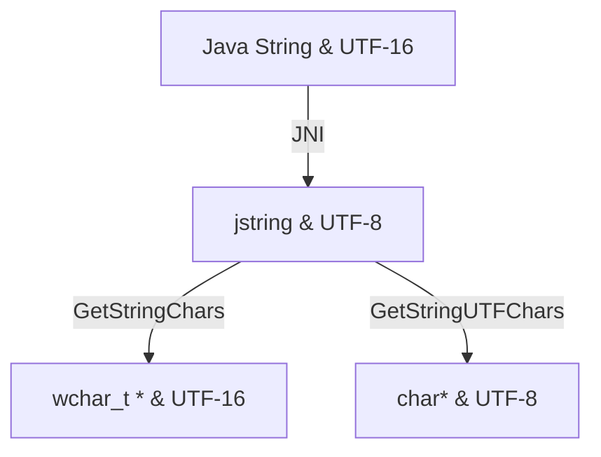

## 1 什么是JNI

JNi就是java调用本地方法的技术，最简单的来说，java运行一个程序需要要和不同的系统平台打交道，在windows里就是和windows平台底层打交道，mac就是要和mac打交道，jvm就是通过大量的jni技术使得java能够在不同平台上运行。


### 1.1 Java和C/C++中的基本类型的映射关系：

JNI是接口语言，因而，会有一个中间的转型过程.在这个过程中，有一个非常重要的也是非常关键的类型对接方式，这个方式便是，数据类型的转变，下表给出了相关的对于的数据格式。

| java类型 | jni类型    | 描述             |
| -------- | ---------- | ---------------- |
| boolean  | jboolean   | unsigned 8 bits  |
| byte     | jbyte      | signed 8 bits    |
| char     | jchar      | unsigned 16 bits |
| short    | jshort     | signed 16 bits   |
| int      | jint       | signed 32 bits   |
| long     | jlong      | signed 64 bits   |
| float    | jfloat     | signed 32bit     |
| double   | jdouble    | signed 64 bits   |
| Class    | jclass     | class类对象      |
| String   | jstring    | 字符串对象       |
| Object   | jobject    | 任何java对象     |
| byte[]   | jbyteArray | byte数组         |

这个表都是JNI开发中java和JNI之间数据的适配。


## 2.动态库和静态库

java开发我们可以封装为jar包提供给别人用，安卓平台后来可以打包成aar包，同样的，C/C++中我们封装的功能或者函数可以通过静态库或者动态库的方式提供给别人使用。


Linux平台静态库以.a结尾，而动态库以.so结尾。

分析链接库首先要分析**交叉编译**


### 2.1什么是交叉编译?

交叉编译就是在A平台编译出可以在B平台执行的文件，对于我们安卓开发者来说交叉编译就是在window或者mac或者linux系统上编译出可在安卓系统上运行的可执行文件.

**什么时候需要用到交叉编译呢？**音视频开发基本都会用到fmpeg，opengl es等三方库，这时我们就需要在window或者mac或者linux系统上编译出可在安卓系统执行的文件，这里可编译出静态库或者动态库使用，这时候就会用到交叉编译。

**交叉编译的目的很清楚，就是编译出除了自己平台意外其他平台可以用的库的过程。**


### 2.2 动态库和静态库


#### 2.2.1静态库

这类库的名字一般是libxxx.a；

利用静态函数库编译成的文件比较大，因为整个函数库的所有数据都会被整合进目标代码中，他的优点显而易见，即编译后的执行程序不需要外部的函数库支持，因为所有使用的函数都已经被编译进去了。当然这也会成为他的缺点，因为如果静态函数库改变了，那么你的程序必须重新编译。

#### 2.2.2动态库

这类库的名字一般是libxxx.so;相对于静态函数库，动态函数库在编译的时候并没有被编译进目标代码中，你的程序执行到相关函数时才调用该函数库里的相应函数，因此动态函数库所产生的可执行文件比较小。由于函数库没有被整合进你的程序，而是程序运行时动态的申请并调用，所以程序的运行环境中必须提供相应的库。动态函数库的改变并不影响你的程序，所以动态函数库的升级比较方便


静态库的代码在编译过程中已经被载入可执行程序,因此体积比较大；

动态库(共享库)的代码在可执行程序运行时才载入内存，在编译过程中仅简单的引用，因此代码体积比较小。


### 2.3 Android如何配置cmakelist.txt配置编译动态库和静态库?

```cmake
add_labrary(jinInterface SHARED library.c library.h)// SHARED-动态库
add_labrary(jinInterface STATIC library.c library.h)// STATIC-静态库
语法：
ADD_LIBRARY(libname [SHARED|STATIC] ...)
上面的表达式等同于：
set(LIB_SRC library.c library.h)
add_library(jinInterface SHARED ${LIB_SRC})
```


## 3.JNI动态注册与静态注册


### 3.1静态注册

 1）编写java类，假如是JniTest.java

2）在命令行下输入javac JniTest.java生成JniTest.class文件

3)在JniTest.class目录下通过javah xxx.JniTest(全类名)生成xxx_JniTest.h头文件

4）编写xxx_JniTest.c源文件，并拷贝xxx_JniTest.h下的函数，并实现这些函数，且在其中添加jni.h头文件；

5）编写cmakelist.txt文件，编译生成动态/静态链接库


### 3.2动态注册

在jni中使用的Java_PACKAGENAME_CLASSNAME_METHODNAME来进行与java方法的匹配，这种方式我们称之为静态注册。


动态注册则意味着方法名可以不用这么长，会动态将java层与native方法一一绑定.

```
//Java:
native void dynamicNative();
native String dynamicNative(int i);
//C++：
void dynamicNative1(JNIEnv *env,jobject jobj){
  LOGE("dynamicNative1 动态注册");
}

jstring dynamicNative2(JNIEnv *env,jobject jobj,jint i){
return env->NewStringUTF("我是动态注册的 dynamicNative2 方法");
}
//需要动态注册的方法数组
static const JNINativeMethod mMethods[]
 =
{ 
{"dynamicNative","()V",
(void*)dynamicNative1},
{"dynamicNative","(I)Ljava/lang/String;",
(jstring*)dynamicNative2}
};

// 需要动态注册
native 方法的类名 
static const char*mClassName = "com/dongnao/jnitest/MainActivity";
jint JNI_OnLoad(JavaVM* vm, void* reserved){
JNIEnv* env = NULL;
//获得JniEnv
int r = vm->GetEnv((void**)&env,JNI_VERSION_1_4);
if(r!=JNI_OK){
 return -1;
}
jclass mainActivityCls = env->FindClass(mClassName);

//注册如果小于0则注册失败
r= env->RegisterNatives(mainActivityCls,mMethods,3);
if(r!=JNI_OK)
{
return -1;
}
return JNI_VERSION_1_4;
}
```

注:RegisterNatives(mainActivityCls,mMethods,**3**);
這個一定要与method数组长度匹配,否则出现以下错误日志:

> # Failed to write core dump. Core dumps have been disabled. To enable core dumping, try "ulimit -c unlimited" before starting Java again.


### 3.3 system.load()/system.loadLibrary()区别

**System.load**

System.load参数必须为库文件的绝对路径，可以是任意路径，

例如：

System.load("C:\Documents andSettings\TestJNI.dll");//Windows

System.load("/usr/lib/TestJNI.so"); //Linux


**System.loadLibrary**

System.loadLibrary参数为库文件名，不包含库文件的扩展名。

System.loadLibrary ("TestJNI"); //加载Windows下的TestJNI.dll本地库System.loadLibrary ("TestJNI"); //加载Linux下的libTestJNI.so本地库

注意：**TestJNI.dll或libTestJNI.so必须是在JVM属性java.library.path所指向的路径中。**


## 4.JNIEnv类型和jobject类型的解释

```
JNIEXPORT void JNICALL Java_com_jni_demo_JNIDemo_sayHello
(JNIEnv* env,jobject obj){
   printf(hello);
}
```

### 4.1  JNIEnv* env参数的解释

JNIEnv类型实际上代表了Java环境，通过这个JNIEnv* 指针，就可以对Java端的代码进行操作。
例如，创建Java类中的对象，调用Java对象的方法，获取Java对象中的属性等等。JNIEnv的指针
会被JNI传入到本地方法的实现函数中来对Java端的代码进行操作。

```
#ifdef __cplusplus
typedef JNIEnv_ JNIEnv;
#else
typedef const struct JNINativeInterface_ *JNIEnv;
#endif
......
struct JNIInvokeInterface_;
......
struct JNINativeInterface_
{
  void *reserved0;
  void *reserved1;
  void *reserved2;
  void *reserved3;
  jint(JNICALL *GetVersion)(JNIEnv *env);
//全是函数指针
jclass (JNICALL *DefineClass)
  (JNIEnv *env, const char *name,jobject loader,const jbyte *buf,
  jsize len);

jclass (JNICALL *FindClass)
  (JNIEnv *env, const char *name);

jmethodID (JNICALL *FromReflectedMethod)
  (JNIEnv *env,jobject method);

jfieldID (JNICALL *FromReflectedField)
  (JNIEnv *env, jobject field);

jobject (JNICALL *ToReflectedMethod)
  (JNIEnv *env,jclass cls, jmethodID methodID,jbooleanisStatic);
```

### 4.2 参数jobject obj解释

native 方法为非static普通方法：这个obj代表native方法的类实例
native 方法为static：这个obj就代表这个native方法的类的class对象实例

java 部分代码:

```
public native void test();
public static native void testStatic();
```

jni .h部分代码:

```
JNIEXPORT void JNICALL Java_Hello_test
(JNIEnv *, jobject);

JNIEXPORT void JNICALL Java_Hello_testStatic
(JNIEnv *, jclass);
```

## 5.C/C++ 代码调用java代码

JNI中有一个非常重要的内容，那便是在C/C++本地代码中访问Java端的代码，
一个常见的应用就是获取类的属性和调用类的方法，为了在C/C++中表示属性和方法，
JNI在jni.h头文件中定义了jfieldId,jmethodID 类型来分别代表Java端的属性
和方法。

在访问，或者设置Java属性的时候，
首先就要先在本地代码取得代表该Java属性的jfieldID,
然后才能在本地代码中进行Java属性操作，
同样的，我们需要呼叫Java端的方法时，也是需要取得代
表该方法的jmethodID才能进行Java方法调用。
使用JNIEnv的：
GetFieldID/GetMethodID
GetStaticFieldID/GetStaticMethodID
来取得相应的jfieldID和jmethodID。

```
GetFieldID(jclass clazz,const char* name,const char* sign)
方法的参数说明:
clazz: 这个简单就是这个方法依赖的类对象的class对象
name: 这个是这个字段的名称
sign:这个是这个字段的签名
(我们知道每个变量，每个方法都是有签名的)
```

上面代码中参数sign(签名)怎么来的，签名的格式是怎样的？

### 5.1签名Sign问题

#### 5.1.1　查看类中字段和签名

可以用　javap -s JniTest.class　命令查看．descriptor：后就是签名．


#### 5.1.2 java字段的签名规则

| 数据类型 | 签名                                           |
| -------- | ---------------------------------------------- |
| boolean  | Z                                              |
| byte     | B                                              |
| char     | C                                              |
| short    | S                                              |
| int      | I                                              |
| long     | J                                              |
| float    | F                                              |
| double   | D                                              |
| void     | V                                              |
| object   | L开头+类名+;如: Ljava/lang/String;             |
| Array    | 以[开头，加数据类型签名．如:int[] 即可表示为[I |

eg:

Java代码:

```
import java.util.Date;

public class HelloJni{
	public int property;
	public int function(int fu,Date date,int[] arr){
		System.out.println("function");
		return 0;
	}
	public native void testJni();
}
```

JNI代码：

```
JNIEXPOR void Java_HelloJni_testJni(JNIEnv *env,jobject jobj){
	jclass h_clz = (*env)->GetObjectClass(env,jobj);
	//HelloJni.java:: **int** property -> I
	jfieldID filedId_prop = (*env)-> GetFieldID(env,h_clz,"property","I");
	//HelloJni.java::public int function(int fu,Date date,int[] arr) -> 参数:(ILjava/util/Date;[I)+返回值:I
	JMethodID methodId_func = (*env)->GetMethodID(env,h_clz,"function","(ILjava/util/Date;[I)I");
	(*env)->CallIntMethod(env,jobj,methodId_func,0L,NULL,NULL);
}
```


### 5.2 JNI字符串访问



**注**

- java内部使用的是utf-1616bit的编码方式
- jni里面使用的utf-8unicode编码方式英文是1个字节，中文3个字节
- C/C++使用ascii编码，中文的编码方式GB2312编码中文2个字节

但一般我们写代码的时候用不到中文字符
